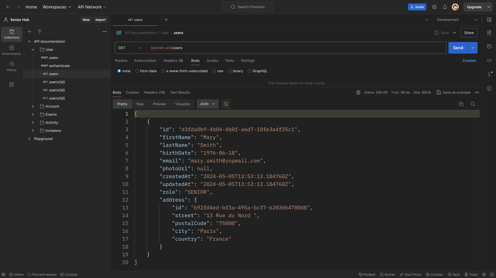

# Care Hub API

This is a Spring Boot project serving as the backend for
my [Care Hub Next.js Application](https://github.com/ericafenyo/care-hub)



## API Documentation

Visit [this page](docs/api/documentation.md) for complete API documentation with example responses.

> The documentation is still in progress.

## Building and Testing

Prerequisite

- Java 17
- Docker and Docker Compose.

Clone the repository and navigate to the project directory:

```sh
git clone [repository_url]
cd senior-hub-api
```

Install Dependencies:

```sh
./mvnw clean install
```

Start both the database and SMTP server using Docker Compose:

```sh
docker-compose up
```

Run the Application:

```sh
./mvnw spring-boot:run
```

> The application will be available at `http://localhost:8080`.

Finally, run database migrations/seeds:

```shell
./mvnw liquibase:update
```

```sh

## License

This project is licensed under the MIT License - see the [LICENSE](LICENSE) file for details.
